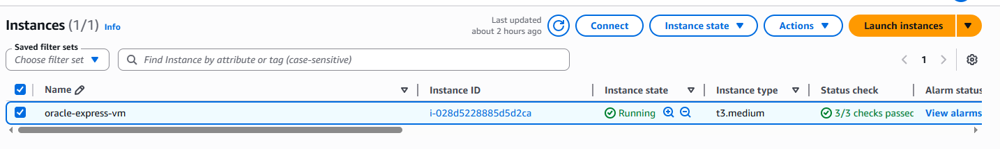
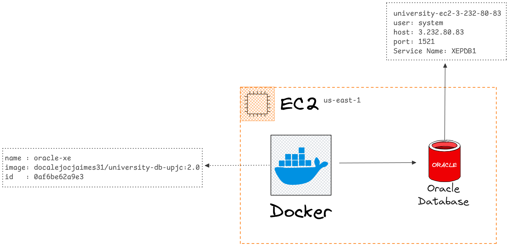
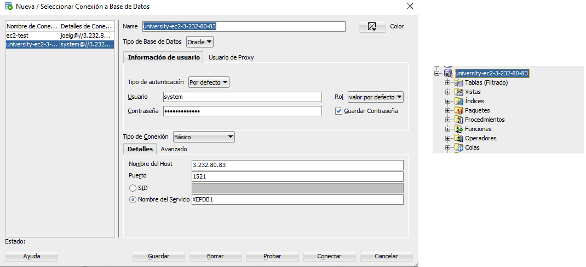
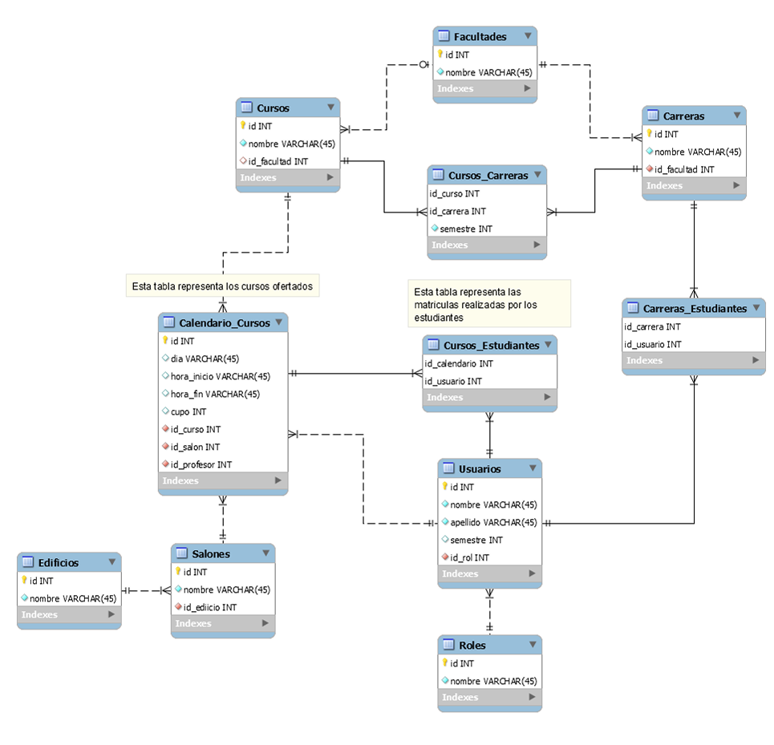
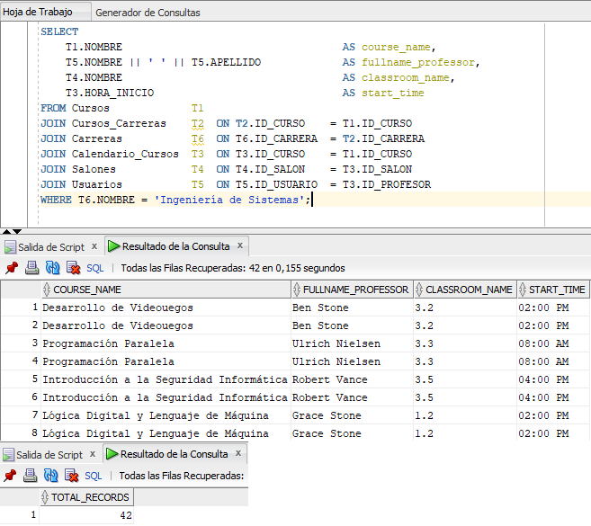
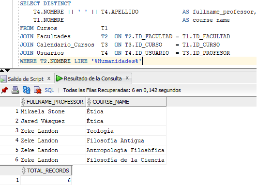
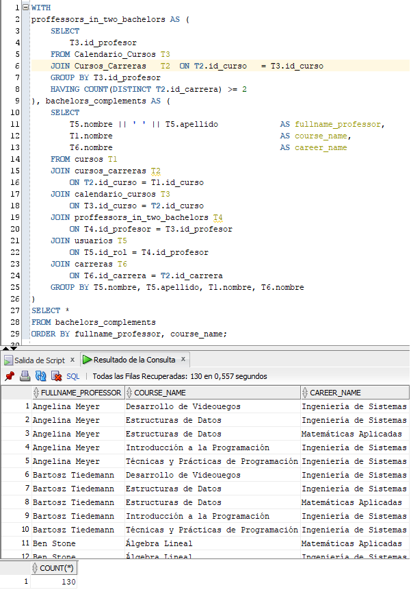
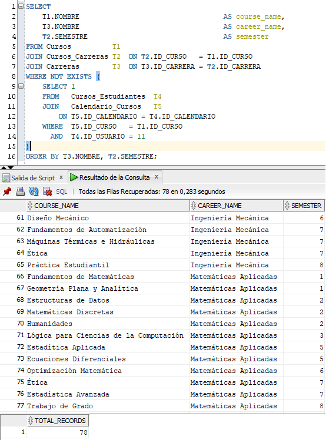
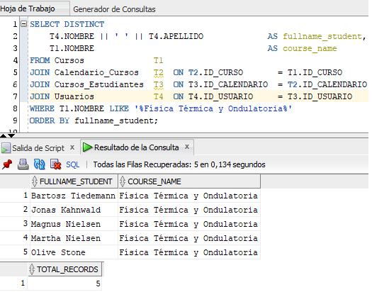

<div align="center">


# Universidad Pontificia Javeriana Cali

**Facultad de Ingeniería**

---

### Informe de Ejercicio Práctico
### Unidad 2: Bases de Datos Relacionales

**Asignatura:** Gestión de Datos 20261-A  
**Docente:** Martín Vladimir Alonso Sierra Galvis  
**Periodo Académico:** 2026-1  
**Fecha de entrega:** Abril de 2026  

---

| Integrante | Programa |
|---|---|
| Ivan Darío García Ramos | Gestión de Datos — 20261A |
| Joel Ángel Gonzales Flores | Gestión de Datos — 20261A |
| Juan Alejandro Carrillo Jaimes | Gestión de Datos — 20261A |

---

</div>

---

## 1. Infraestructura y Configuración del Entorno

### 1.1 Instancia EC2 en AWS

Para el despliegue del motor de base de datos Oracle 21c se utilizó una instancia **EC2 t3.medium** en la región **us-east-1b (N. Virginia)** de Amazon Web Services. La elección de este tipo de instancia se justifica por los requerimientos de recursos que exige Oracle Database XE 21c: la instancia t3.medium ofrece **2 vCPUs y 4 GB de RAM**, lo cual es suficiente para levantar el servicio de forma estable en un entorno académico. Instancias de menor capacidad (como t2.micro o t3.micro) no cuentan con la memoria mínima necesaria para que el proceso de Oracle arranque correctamente.




### 1.2 Despliegue de Oracle 21c Express con Docker

Una vez aprovisionada la instancia EC2, se procedió a instalar **Docker** sobre el sistema operativo de la instancia y se levantó un contenedor con la imagen oficial de **Oracle Database 21c Express Edition (XE)**. El uso de Docker permitió simplificar el proceso de instalación, evitando la configuración manual del motor directamente sobre el sistema operativo, y garantizando un entorno reproducible y aislado.

El servicio quedó expuesto en el puerto estándar de Oracle: **1521**, con el nombre de servicio **XEPDB1**.



### 1.3 Conexión desde SQL Developer

La conexión al motor de base de datos se realizó desde **Oracle SQL Developer**, configurando los parámetros correspondientes a la instancia EC2 pública. A continuación se muestra la configuración utilizada:

| Parámetro | Valor |
|---|---|
| Tipo de Base de Datos | Oracle |
| Tipo de Autenticación | Por defecto |
| Usuario | system |
| Tipo de Conexión | Básico |
| Nombre del Host | 3.232.80.83 |
| Puerto | 1521 |
| Nombre del Servicio | XEPDB1 |



---

## 2. Modelo Entidad-Relación

El modelo de base de datos sobre el que se desarrollaron los ejercicios está compuesto por las siguientes tablas:

| Tabla | Descripción |
|---|---|
| `Cursos` | Catálogo de cursos académicos |
| `Cursos_Carreras` | Relación entre cursos y carreras, incluye el semestre |
| `Carreras` | Programas académicos ofertados |
| `Facultades` | Facultades de la universidad |
| `Calendario_Cursos` | Oferta de cursos: profesor, salón, horario |
| `Salones` | Salones disponibles por edificio |
| `Edificios` | Edificios del campus |
| `Usuarios` | Estudiantes y profesores del sistema |
| `Roles` | Roles de usuario (estudiante, profesor, etc.) |
| `Cursos_Estudiantes` | Matrículas: relación entre calendario y estudiante |
| `Carreras_Estudiantes` | Relación entre estudiantes y carreras |



---

## 3. Desarrollo de Consultas

A continuación se presentan las cinco consultas propuestas en el ejercicio, con su respectivo análisis, código SQL y espacio para el resultado obtenido en SQL Developer.

---

### Consulta A — Cursos ofrecidos en la carrera de Ingeniería de Sistemas

**Enunciado:** Listar todos los cursos ofrecidos en la carrera de Ingeniería de Sistemas. Un mismo curso puede ser dictado por profesores diferentes, en salones diferentes y en horarios diferentes. Se deben obtener: el nombre del curso, el nombre completo del profesor, el salón y la hora de inicio.

**Análisis:** Se parte de la tabla `Cursos` y se navega hacia `Cursos_Carreras` para filtrar por la carrera deseada. Luego, a través de `Calendario_Cursos` se obtiene el horario, el salón (`Salones`) y el profesor (`Usuarios`). Dado que un curso puede tener múltiples ofertas (diferentes profesores/horarios), cada combinación aparece como una fila independiente.

```sql
SELECT
    T1.NOMBRE                                   AS course_name,
    T5.NOMBRE || ' ' || T5.APELLIDO             AS fullname_professor,
    T4.NOMBRE                                   AS classroom_name,
    T3.HORA_INICIO                              AS start_time
FROM Cursos             T1
JOIN Cursos_Carreras    T2  ON T2.ID_CURSO    = T1.ID_CURSO
JOIN Carreras           T6  ON T6.ID_CARRERA  = T2.ID_CARRERA
JOIN Calendario_Cursos  T3  ON T3.ID_CURSO    = T1.ID_CURSO
JOIN Salones            T4  ON T4.ID_SALON    = T3.ID_SALON
JOIN Usuarios           T5  ON T5.ID_USUARIO  = T3.ID_PROFESOR
WHERE T6.NOMBRE = 'Ingeniería de Sistemas';
```

**Resultado:**



---

### Consulta B — Profesores que dictan cursos en la Facultad de Humanidades

**Enunciado:** Obtener la lista de profesores que dictan cursos pertenecientes a la facultad de Humanidades. Se deben obtener: el nombre completo del profesor y el nombre del curso que dicta.

**Análisis:** La relación entre un curso y su facultad se establece directamente a través de `Cursos.ID_FACULTAD`. Desde allí se une con `Facultades` para aplicar el filtro. Luego, `Calendario_Cursos` provee el vínculo con el profesor en `Usuarios`. Se utiliza `DISTINCT` para evitar duplicados cuando un profesor dicta el mismo curso en varios horarios.

```sql
SELECT DISTINCT
    T4.NOMBRE || ' ' || T4.APELLIDO             AS fullname_professor,
    T1.NOMBRE                                   AS course_name
FROM Cursos             T1
JOIN Facultades         T2  ON T2.ID_FACULTAD = T1.ID_FACULTAD
JOIN Calendario_Cursos  T3  ON T3.ID_CURSO    = T1.ID_CURSO
JOIN Usuarios           T4  ON T4.ID_USUARIO  = T3.ID_PROFESOR
WHERE T2.NOMBRE = 'Humanidades';
```

**Resultado:**



---

### Consulta C — Profesores que dictan cursos en dos carreras diferentes

**Enunciado:** Obtener la lista de profesores que dictan cursos en dos carreras diferentes. Se deben obtener: el nombre completo del profesor, el nombre del curso y el nombre de la carrera. Se recomienda usar la cláusula `WITH`.

**Análisis:** Se emplea una CTE (`WITH`) para identificar primero los `ID_PROFESOR` que aparecen asociados a dos o más carreras distintas, cruzando `Calendario_Cursos` con `Cursos_Carreras`. Una vez identificados esos profesores, la consulta principal recupera el detalle de cada curso y carrera que dictan. El `GROUP BY` evita repeticiones cuando el mismo curso se oferta en múltiples horarios.

```sql
WITH
proffessors_in_two_bachelors AS (
    SELECT 
        T3.id_profesor
    FROM Calendario_Cursos T3
    JOIN Cursos_Carreras   T2  ON T2.id_curso   = T3.id_curso
    GROUP BY T3.id_profesor
    HAVING COUNT(DISTINCT T2.id_carrera) >= 2
), bachelors_complements AS (
    SELECT
        T5.nombre || ' ' || T5.apellido             AS fullname_professor,
        T1.nombre                                   AS course_name,
        T6.nombre                                   AS career_name
    FROM cursos T1
    JOIN cursos_carreras T2
        ON T2.id_curso = T1.id_curso
    JOIN calendario_cursos T3
        ON T3.id_curso = T2.id_curso
    JOIN proffessors_in_two_bachelors T4
        ON T4.id_profesor = T3.id_profesor
    JOIN usuarios T5
        ON T5.id_rol = T4.id_profesor
    JOIN carreras T6
        ON T6.id_carrera = T2.id_carrera
    GROUP BY T5.nombre, T5.apellido, T1.nombre, T6.nombre
)
SELECT *
FROM bachelors_complements
ORDER BY fullname_professor, course_name;
```

**Resultado:**



---

### Consulta D — Cursos disponibles para matricular por un estudiante

**Enunciado:** Para un estudiante en particular, obtener el listado de cursos que puede matricular. Un estudiante no puede matricular un curso que ya se encuentre matriculado. Se deben obtener: el nombre del curso, el nombre de la carrera y el semestre. Se recomienda usar `NOT EXISTS`.

**Análisis:** Se listan todos los cursos disponibles en `Cursos_Carreras` (junto con su carrera y semestre), y se excluyen aquellos que el estudiante ya tiene matriculados. La subconsulta con `NOT EXISTS` verifica en `Cursos_Estudiantes`, enlazando con `Calendario_Cursos` para obtener el `ID_CURSO` asociado a cada matrícula del estudiante. El valor `11` debe reemplazarse por el `ID_USUARIO` del estudiante en cuestión, para este caso, se eligió este estudiante, que tiene _9_ cursos matriculados, de 71 cursos disponibles en toda la base. Lo que dá un total de 62 cursos restantes para matrícular, pero al tener el mismo curso en diferentes carreras, el resultado se duplica, generando 78 posibilidades de matrícula.

```sql
SELECT
    T1.NOMBRE                                   AS course_name,
    T3.NOMBRE                                   AS career_name,
    T2.SEMESTRE                                 AS semester
FROM Cursos          T1
JOIN Cursos_Carreras T2  ON T2.ID_CURSO   = T1.ID_CURSO
JOIN Carreras        T3  ON T3.ID_CARRERA = T2.ID_CARRERA
WHERE NOT EXISTS (
    SELECT 1
    FROM   Cursos_Estudiantes  T4
    JOIN   Calendario_Cursos   T5  ON T5.ID_CALENDARIO = T4.ID_CALENDARIO
    WHERE  T5.ID_CURSO   = T1.ID_CURSO
      AND  T4.ID_USUARIO = 1   -- Reemplazar con el ID del estudiante
)
ORDER BY T3.NOMBRE, T2.SEMESTRE;
```

**Resultado:**



---

### Consulta E — Estudiantes inscritos en un curso determinado

**Enunciado:** Listar los estudiantes que se han inscrito a un curso determinado. Se deben obtener: el nombre completo del estudiante y el nombre del curso.

**Análisis:** Se parte de `Cursos` filtrando por el nombre del curso deseado. A través de `Calendario_Cursos` se llega a `Cursos_Estudiantes`, que registra las matrículas, y finalmente se une con `Usuarios` para obtener los datos del estudiante. Se usa `DISTINCT` para evitar que un estudiante aparezca varias veces si está inscrito en más de una sesión del mismo curso. El valor `'Física Térmica y Ondulatoria'` debe reemplazarse por el nombre del curso de interés.

```sql
SELECT DISTINCT
    T4.NOMBRE || ' ' || T4.APELLIDO             AS fullname_student,
    T1.NOMBRE                                   AS course_name
FROM Cursos              T1
JOIN Calendario_Cursos   T2  ON T2.ID_CURSO       = T1.ID_CURSO
JOIN Cursos_Estudiantes  T3  ON T3.ID_CALENDARIO  = T2.ID_CALENDARIO
JOIN Usuarios            T4  ON T4.ID_USUARIO     = T3.ID_USUARIO
WHERE T1.NOMBRE = 'Física Térmica y Ondulatoria'
ORDER BY fullname_student;
```

**Resultado:**



---

## 4. Conclusiones

El desarrollo de este ejercicio permitió aplicar de forma práctica los conceptos fundamentales de las bases de datos relacionales sobre un entorno real desplegado en la nube. La configuración de Oracle 21c XE sobre una instancia EC2 t3.medium mediante Docker demostró ser una alternativa eficiente para ambientes académicos, ya que reduce la complejidad de instalación y garantiza portabilidad. Las consultas desarrolladas abarcaron desde joins básicos hasta técnicas más avanzadas como Common Table Expressions (`WITH`) y subconsultas correlacionadas (`NOT EXISTS`), herramientas fundamentales para resolver problemas de filtrado y cruce de datos en esquemas relacionales complejos.

---

*Documento elaborado para la asignatura Gestión de Datos 20261-A — Universidad Pontificia Javeriana Cali, abril de 2026.*
